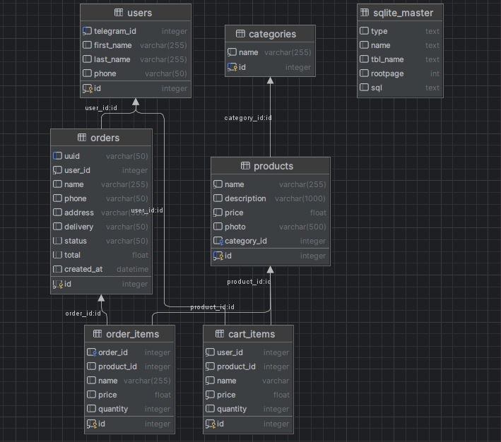

# E-Commerce Бот

## Описание

Телеграм-бот для управления интернет-магазином.  
Функционал:
- Добавление и редактирование товаров
- Работа с категориями
- Управление заказами (изменение статусов)
- Просмотр заказов пользователями и админами
- Inline-кнопки и удобный интерфейс

## Установка и запуск

1. Клонировать проект:
git clone https://github.com/HoST1er/E-Commerce-Bot.git
cd E-Commerce-Bot
2. Установить зависимости
pip install -r requirements.txt
3. Создание таблиц
python create_tables.py
4. Заполнение таблиц данными
python seed.py
5. Запустить бота
python bot.py

## Архитектура проекта

1. bot.py (Запускает бота, регистрирует хендлеры и запускает бесконечный цикл bot.polling()).
2.  handlers/ (Содержит обработчики сообщений и callback-запросов. Каждый модуль отвечает за свою область (товары, заказы, пользователи)).
3. models/ (Описывает сущности (таблицы БД). Реализует доступ к данным (ORM или SQL-запросы)).
4. services/ (Слой бизнес-логики. Работает с моделями и реализует операции (создать заказ, изменить статус, проверить доступ)).
5. utils/ (Хранит вспомогательные функции (клавиатуры, проверки, утилиты)).
6. logs/ (Логирование действий бота, ошибок и событий).
7. media/ (Файлы, загружаемые пользователями (например, фото товаров)).

## API методы

1. /start — стартовое сообщение
2. /admin — вход в админ-панель
3. Inline callback:
    category:{id}
    status:{order_id}:{new_status}

## Схема базы данных

